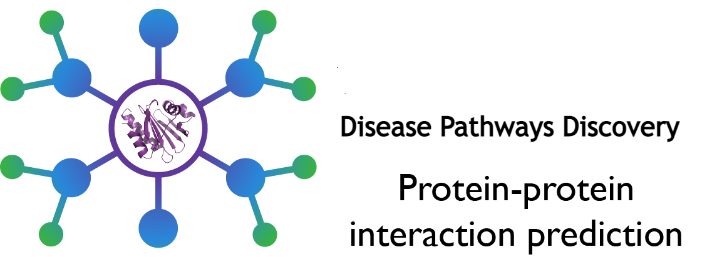
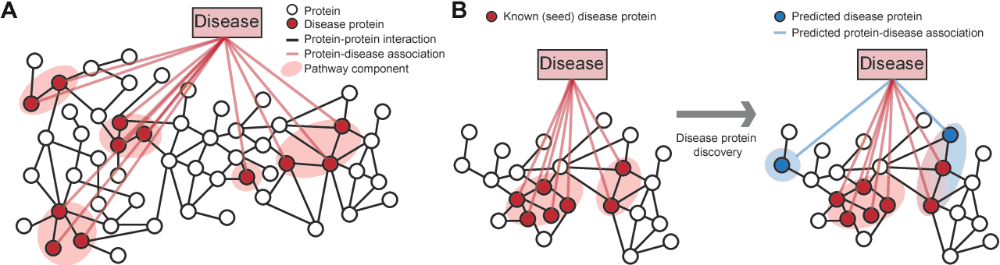

# Protein Protein Interaction Prediction

* In the notebook, we demonstrate the utility of deep learning methods for an important prediction problem on biological graphs. In particular, we consider the problem of predicting protein-protein interactions (PPIs). One of the famous application fields is the Disease Pathways Discovery. Which can be defined as sets of proteins associated with a given disease, is an important problem that has the potential to provide clinically actionable insights for disease diagnosis, prognosis, and treatment. Computational methods aid the discovery by relying on protein-protein interaction (PPI) networks.

